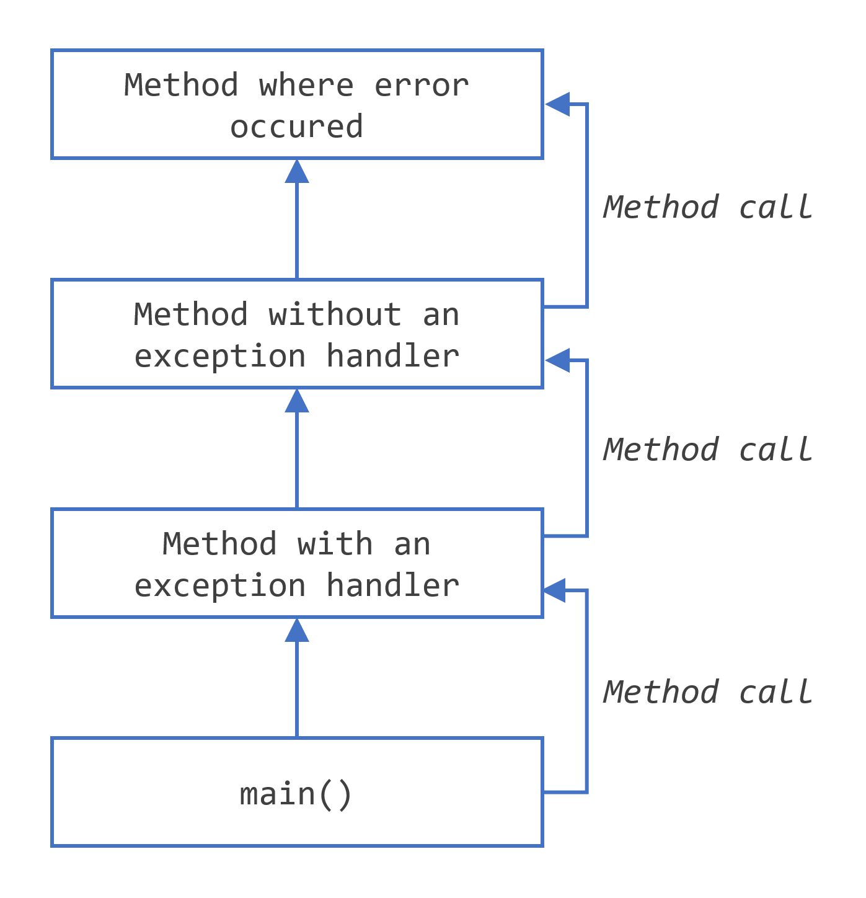
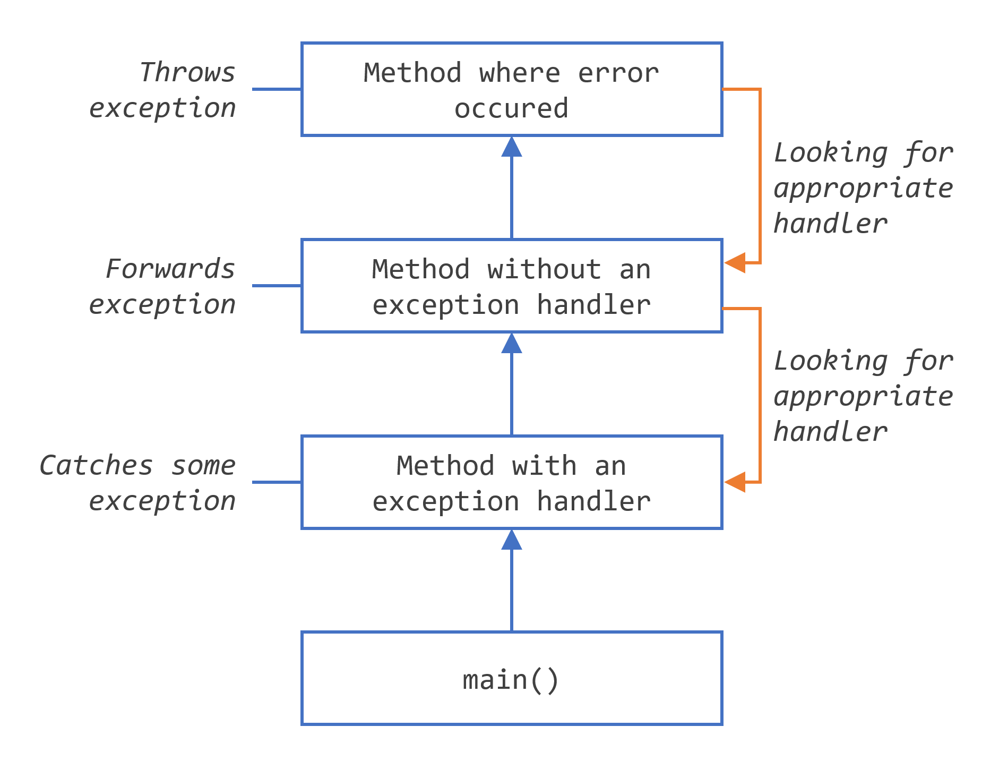

= Throwable in Java
:reproducible:
:author: Herman Ciechanowiec
:email: herman@ciechanowiec.eu
:chapter-signifier:
:sectnumlevels: 5
:sectanchors:
:toc: left
:toclevels: 5
:icons: font

// To center the images titles:
++++

++++

== Description of the Repository
This repository is a workshop on `Throwable` in Java, mainly on its `Exception` subclass. It presents key points regarding that issue and relevant usage cases.

Run `main` methods in appropriate classes to see how `Throwable` types behave.

This readme is supplemented by `questions.adoc` stored in the root folder of the repository.

== General Information about Exceptions
=== Exception in Programming in General
The _exception_ is an event, which occurs during the execution of a program, that disrupts the normal flow of the program's instructions. `Throwable` is Java implementation of an idea of an exception.

=== Exception Throwing
When an error occurs within a method, the method creates an object and hands it off to the runtime system. The object, called an exception object, contains information about the error, including its type and the state of the program when the error occurred. Creating an exception object and handing it to the runtime system is called throwing an exception.

=== Exception Propagating
After a method throws an exception, the runtime system attempts to find something to handle it. The set of possible "somethings" to handle the exception is the ordered list of methods that had been called to get to the method where the error occurred. The list of methods is known as the call stack (see the next figure).

[#call-stack]
.Call stack

The runtime system searches the call stack for a method that contains a block of code that can handle the exception. This block of code is called an exception handler. The search begins with the method in which the error occurred and proceeds through the call stack in the reverse order in which the methods were called. When an appropriate handler is found, the runtime system passes the exception to the handler. An exception handler is considered appropriate if the type of the exception object thrown matches the type that can be handled by the handler.

The exception handler chosen is said to catch the exception. If the runtime system exhaustively searches all the methods on the call stack without finding an appropriate exception handler, as shown in the next figure, the runtime system (and, consequently, the program) terminates.

[#stack-search]
.Searching the call stack for the exception handler

== Throwable
`Throwable` is a non-abstract, non-final super-class for `Exception`++s++ and `Error`++s++.

=== Throwable Hierarchy
[#throwable-hierarchy]
.`Throwable` hierarchy
image::src/main/resources/tree.png[align="center"]

=== Throwable Types
Below some of the most common types of `Throwable` in Java are listed. Their usage examples are provided in the `eu.ciechanowiec.throwable.throwableproducer` package.

==== Exceptions
. ClassNotFoundException
. IOException
. ParseException
. InterruptedException
. NumberFormatException
. RuntimeException:
* ArithmeticException
* NullPointerException
* IndexOutOfBoundsException
* IllegalArgumentException
* IllegalStateException
* ClassCastException

==== Errors
. StackOverflowError
. ExceptionInInitializerError

==== Mnemonics
Checked exceptions: C **io** P **i** N

Unchecked exceptions: **A** n i i **C**

=== `Throwable` Constructors
[source, java]
----
Throwable()
Throwable(String message)
Throwable(Throwable cause)
Throwable(String message, Throwable cause, boolean enableSuppression, boolean writableStackTrace)
Throwable(String message, Throwable cause)
----

=== `Throwable` Methods
|===
^|Modifier and Type ^|Method ^|Description

|`final void`
|`addSuppressed(Throwable exception)`
|Appends the specified exception to the exceptions that were suppressed in order to deliver this exception

|`Throwable`
|`fillInStackTrace()`
|Fills in the execution stack trace

|`Throwable`
|`getCause()`
|Returns the cause of this throwable or null if the cause is nonexistent or unknown

|`String`
|`getLocalizedMessage()`
|Creates a localized description of this throwable

|`String`
|`getMessage()`
|Returns the detail message string of this throwable

|`StackTraceElement[]`
|`getStackTrace()`
|Provides programmatic access to the stack trace information printed by printStackTrace()

|`final Throwable[]`
|`getSuppressed()`
|Returns an array containing all of the exceptions that were suppressed, typically by the try-with-resources statement, in order to deliver this exception

|`Throwable`
|`initCause(Throwable cause)`
|Initializes the cause of this throwable to the specified value

|`void`
|`printStackTrace()`
|Prints this throwable and its backtrace to the standard error stream

|`void`
|`printStackTrace(PrintStream s)`
|Prints this throwable and its backtrace to the specified print stream

|`void`
|`printStackTrace(PrintWriter s)`
|Prints this throwable and its backtrace to the specified print writer

|`void`
|`setStackTrace(StackTraceElement[] stackTrace)`
|Sets the stack trace elements that will be returned by getStackTrace() and printed by printStackTrace() and related methods

|`String`
|`toString()`
|Returns a short description of this throwable
|===

=== `athrow`
`Throwable` and its subclasses (i.a. `Error`) can be thrown because during the compilation they are related with the `athrow` bytecode instruction (see Java Virtual Machine Specification at https://docs.oracle.com/javase/specs/jvms/se17/html/jvms-2.html#jvms-2.10).

== Key Points
=== Keywords
* `throws`
* `try`
* `catch`
* `finally`
* `throw`

=== `finally`
. The `finally` block always executes when the `try` block exits. This ensures that the `finally` block is executed even if an unexpected exception occurs (the unexpected exception is propagated to the caller).
. An exception thrown from the `finally` block is propagated to the caller as an exception thrown from the outside of the `try-catch` block; in such a case any unexpected exception thrown from the `try` block and propagated from there to the caller is suppressed by the exception thrown from the `finally` block.
. The `finally` block may not execute if the JVM exits while the `try` or `catch` code is being executed. For instance, if the `System.exit(...)` command inside the `try` block is executed, the program immediately stops; even the `finally` block is not executed.
* See `eu.ciechanowiec.throwable.finally` package.

=== Multicatching
. With inline `catch` blocks (`exception` variable is final then):
+
[source, java]
----
try {
   throw new IndexOutOfBoundsException("Sample exception");
} catch (IndexOutOfBoundsException | ArithmeticException exception) {
   Logger.error(exception);
}
----
. With chained `catch` blocks:
+
[source, java]
----
try {
   throw new IndexOutOfBoundsException("Sample exception");
} catch (IndexOutOfBoundsException exception) {
   Logger.error(exception);
} catch (RuntimeException exception) {
   Logger.error(exception);
}
----
. Exceptions must be caught from the narrower to the broader one. Two same types of exceptions cannot be multicaught.
. In case of inline multicatch only one `exception` variable is possible.
. Types in the inline multicatch block must be disjoint (i.e. that one of them cannot be the subclass of the another one), so that for `IndexOutOfBoundsException` and `RuntimeException` there will be different responses in `catch` blocks. For that reason the following code will not compile:
+
[source, java]
----
try {
    throw new IndexOutOfBoundsException("Sample exception");
} catch (IndexOutOfBoundsException | RuntimeException exception) {
    Logger.error(exception);
}
----
. Both `Error`++s++ and `Exception`++s++ can be multicaught in the same block, both inline and chained.
. See `eu.ciechanowiec.throwable.multicatch` package.

=== try-with-resources
. Any object that implements `AutoCloseable` or `Closeable` can be used as a resource. Neither `null` nor other objects can be passed as a resource - the code will not compile.
. One or more resources can be declared in the try-with-resources block.
. There is no practical difference between `AutoCloseable` and `Closeable` (only historical: `AutoCloseable` was introduced later and `Closeable` extends `AutoCloseable`).
. To implement `AutoCloseable` or `Closeable`, the `close()` method must be implemented.
. If any, even unexpected, exception occurs, `close()` methods of all specified resources are called, which closes those resources.
. The resources are closed in the reverse order from which they were initialized.
. Resources must be `final`, in that:
* a local variable declared in a resource specification is implicitly declared `final` if it is not explicitly declared final,
* an existing variable referred to in a resource specification must be a `final` or effectively `final` variable that is definitely assigned before the try-with-resources statement, or a compile-time error occurs.
. It is possible to use bare try-with-resources block, without `catch` and `finally` block.
. An exception from the closing of one resource does not prevent the closing of other resources. Such an exception is added as a suppressed to the exception that occurred it the `try` block, regardless of whether the exception from the `try` block was or wasn't caught. If there were no exception thrown from the `try` block, the exception that occurred during the closing of one of resources will not be suppressed and will be propagated to the caller.
. See `eu.ciechanowiec.throwable.withresources` package

== Miscellaneous
. By convention, names of custom exceptions should end with `-Exception` suffix (e.g. `ResourceNotFoundException`). However, technically it is possible that the exception name will not follow this convention and, for instance, be named `Object`.
. If a checked exception is caught, then the code inside the `try` block must be able at least hypothetically produce the caught checked exception. This rule doesn't apply to the unchecked exceptions. For that reason, the following code will not compile:
+
[source, java]
----
try {
   System.out.println("This is a 'try block' without a checked exception");
   throw new IndexOutOfBoundsException("Unchecked exception");
} catch (SQLException exception) {
   Logger.error(exception);
}
----

. An exception thrown from the `catch` block is propagated to the caller as an exception thrown from the outside of the `try-catch` block. However, the `finally` block is executed anyway.
. The `return` statement inside the `finally` block will cause any unexpected exception that might be thrown in the `try` or `catch` block to be discarded and not propagated to the caller.
. The `try-finally` block, without the `catch` block, is possible, but the exception from the `try` block will be propagated to the caller.
. See `eu.ciechanowiec.throwable.misc` package

== Handling Caught Exceptions
Below are some possibilities of how to handle caught exceptions. Some of listed actions can be mixed.

. Good practice:
.. log the exception
.. modify the caught exception (e.g. change the stack trace)
.. perform some logic after catching the exception (e.g. remove the file created inside the `try` block)
.. rethrow the caught exception
.. chain exceptions, i.e. set the caught exception as the cause af a new one

. Bad practice:
.. swallow the caught exception (do nothing)
.. change the flow of the program

Mnemonics: Lo _**mo**_ pe _**re**_ ch || Swa _**ch**_

== Checked vs Unchecked - Controversy
There is a controversy regarding the division of exceptions in Java on the *checked* and *unchecked* ones.

=== Arguments in Favour of the Division:
* Checked exceptions thrown by *critical methods* force to handle them, which improves the program stability
* Checked exceptions *describe some behaviour of the method* 

=== Arguments Against the Division:
* It is possible to develop robust software without checked exceptions (e.g. C++ and C= don't have such a concept)
* Checked exceptions enforce the developer to handle them immediately, what can result in quickly and weakly provided exception handling  
* Checked exceptions *violate the open/closed principle*. If a checked exception is thrown from a method and the catch is three levels above, that exception must be declared in the signature of each method in the chain. It means that a change at a low level of the software can force signature changes on many higher levels
* Checked exceptions *break encapsulation* because all functions in the path of a throw must know about details of that low-level exception.

== Sources 
Sources of knowledge on exceptions:

. D. Liang, Introduction to Java Programming and Data Structures, 2019, chapter 12.1-12.9, pp. 475-499
. Oracle tutorials on exceptions in Java:
.. https://docs.oracle.com/javase/tutorial/essential/exceptions/index.html
.. https://dev.java/learn/exceptions/
. The Java Language Specification (ch. 11, ch. 14.20):
+
https://docs.oracle.com/javase/specs/jls/se17/html/index.html
